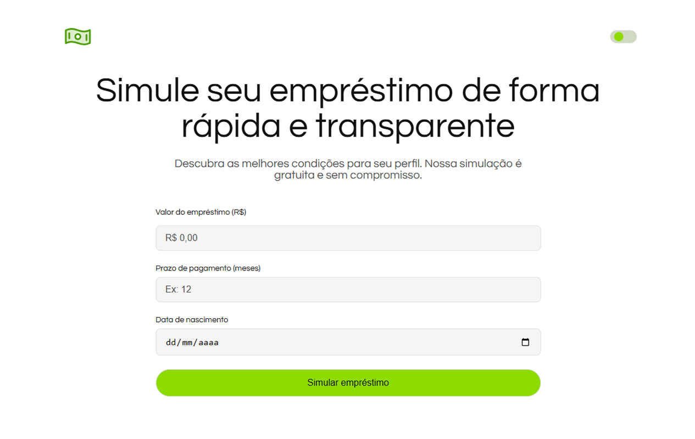
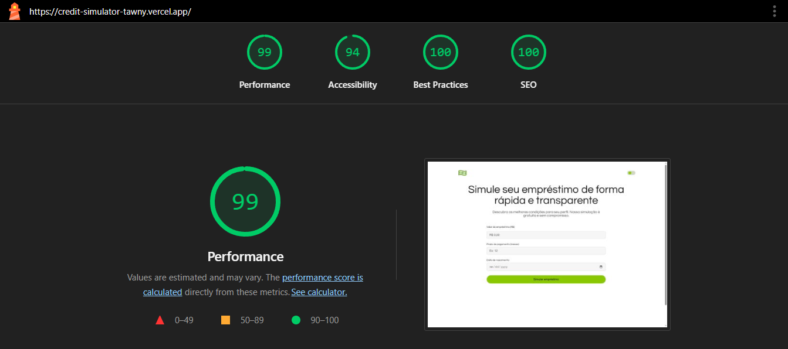
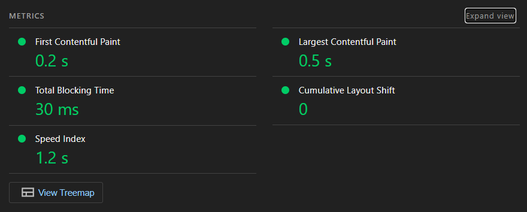

<a href="https://github.com/whosramoss/credit-simulator">
  
  <h1 align="center">Credit Simulator</h1>
</a>

<p align="center">
  Simulador de empréstimos responsivo com Next.js, TypeScript e styled-components, baseado no sistema de parcelas fixas (Price).
</p>

<div align="center">
  
  
  
  
  
  
  
  
  
</div>
<br/>

<br/>

## Sumário

-   [Instalação e Execução](#instalação-e-execução)
-   [Bibliotecas Externas](#bibliotecas-externas)
-   [Decisões Arquiteturais](#decisões-arquiteturais)
-   [Estrutura Modular do Projeto](#estrutura-modular-do-projeto)
-   [Testes](#testes)
-   [Métricas e Qualidade](#métricas-e-qualidade)

## Instalação e Execução

### Instalação

```bash
# Clone o repositório
git clone git@github.com:whosramoss/credit-simulator.git
cd credit-simulator

# Instale as dependências
npm install
```

### Desenvolvimento

```bash
# Inicie o servidor de desenvolvimento
npm run dev

# Acesse http://localhost:3000
```

### Build e Produção

```bash
# Build para produção
npm run build

# Inicie o servidor de produção
npm start
```

## Bibliotecas Externas

-   **Core Framework:** [Next.js](https://nextjs.org/), [React](https://react.dev/), [TypeScript](https://www.typescriptlang.org/)
-   **Estilização:** [styled-components](https://styled-components.com/)
-   **Gerenciamento de Estado:** [zustand](https://zustand-demo.pmnd.rs/)
-   **Formulários e Validação:** [react-hook-form](https://react-hook-form.com/), [zod](https://zod.dev/)
-   **Formatação:** [react-number-format](https://github.com/s-yadav/react-number-format), [date-fns](https://date-fns.org/)
-   **Visualização de Dados:** [recharts](https://recharts.org/)
-   **Testes:** [jest](https://jestjs.io/), [@testing-library/react](https://testing-library.com/docs/react-testing-library/intro/)
-   **Animações:** [framer-motion](https://www.framer.com/motion/)

## Decisões Arquiteturais

### Arquitetura Modular por Domínio

O projeto adota uma **arquitetura modular por domínio** (seguindo princípios do Domain-Driven Design), organizando o código em módulos independentes que representam áreas de negócio específicas. Esta abordagem oferece:

-   **Baixo acoplamento**: Módulos são independentes entre si
-   **Escalabilidade**: Novos módulos podem ser adicionados sem afetar os existentes
-   **Manutenibilidade**: Mudanças em um domínio não impactam outros
-   **Onboarding**: Novos desenvolvedores entendem rapidamente a estrutura

## Estrutura Modular do Projeto

```
src/
├── app/                   # 1 - Next.js App Router
│   ├── layout.tsx              # Layout principal
│   └── page.tsx                # Página inicial
├── modules/               # 2 - Módulos de domínio
│   └── {module-name}/          # Módulo especifico
│       ├── components/         # Componentes específicos do domínio
│       ├── services/           # Lógica de negócio
│       ├── schemas/            # Validação de dados
│       └── store/              # Estado do módulo
├── shared/                # 3 - Recursos compartilhados
│   ├── ui/                     # Componentes de UI reutilizáveis
│   ├── theme/                  # Sistema de temas
│   ├── store/                  # Estado global
│   ├── utils/                  # Utilitários
│   └── hooks/                  # Hooks customizados
└── tests/                 # 4 - Testes organizados por módulos
    └── modules/
        └── {module-name}/
            ├── components/
            ├── schemas/
            ├── services/
            └── store/
```

### Organização dos Módulos

Cada módulo segue uma estrutura consistente (exemplo do modulo de crédito/emprestimo):

```
modules/credit/
├── components/                       # Componentes específicos
│   ├── credit-simulation/              # Componente principal
│   ├── credit-simulation-form/         # Formulário de entrada de dados
│   ├── credit-simulation-result/       # Exibição de resultados
│   ├── credit-chart/                   # Gráficos de amortização
├── services/                         # Lógica de negócio
│   ├── base-credit-service.ts
│   └── price-credit-service.ts
├── schemas/                          # Validação com Zod
│   └── credit-schema.ts
└── store/                            # Estado local do módulo
    └── use-credit-simulation-store.ts
```

## Testes

### Estrutura de Testes

Os testes seguem a estrutura modular do projeto:

```
tests/
└── modules/
    └── credit/
        ├── components/
        │   └── credit-simulation.test.tsx
        ├── schemas/
        │   └── credit-schema.test.ts
        ├── services/
        │   ├── base-credit-service.test.ts
        │   └── price-credit-service.test.ts
        └── store/
            └── use-credit-simulation-store.test.ts
```

### Executar Testes

```bash
# Executar todos os testes
npm test

# Modo watch (desenvolvimento)
npm run test:watch

# Cobertura de testes
npm run test:coverage
```

## Métricas e Qualidade

### Cobertura de Testes

Os testes automatizados cobrem os principais fluxos do módulo de crédito, garantindo a validação das regras de negócio e integridade das funcionalidades.

```bash
Test Suites: 5 passed, 5 total
Tests:       18 passed, 18 total
Snapshots:   0 total
Time:        11.349 s
Ran all test suites matching tests/modules/credit.
```

### Performance - Lighthouse

Score 90+ em todas as métricas usando o plugin [Lighthouse](https://chromewebstore.google.com/detail/lighthouse/blipmdconlkpinefehnmjammfjpmpbjk) para buscar os dados




## Contribuições

Se você deseja contribuir com o `credit-simulator`, por favor, revise as [diretrizes de contribuição](https://github.com/whosramoss/credit-simulator/blob/master/CONTRIBUTING.md).  
Este projeto utiliza as [issues do GitHub](https://github.com/whosramoss/credit-simulator/issues) para acompanhar solicitações e bugs.

## Licença

Licença MIT. [LICENSE](./LICENSE)

## Autor

Gabriel Ramos ([@whosramoss](https://github.com/whosramoss))
